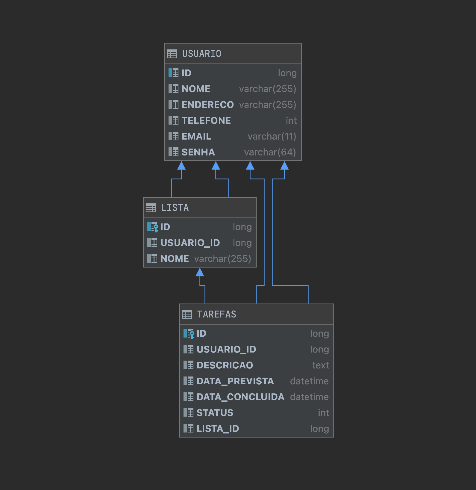

## Desafio Alelo

Criar uma API (tema livre) com:

    - Get/Post/Delete/Put;
    - Testes unitários, usando banco em memória;
    - Teste “mockando” o retorno de uma API de terceiros;
    - Documentação via Swagger;

Caso você não domine algum item do desafio proposto, não desista: envie tudo o que você sabe. O objetivo é avaliar o seu jogo de cintura, seu nível de conhecimento e a sua criatividade. A API deve ser simples, objetiva e aplicar boas práticas de desenvolvimento.

### Implantação
O projeto está configurado para build totalmente automatizada via Maven e pode ser executado via fat-jar ou deploy em servidor por meio de WAR.

Build via jar
>mvn package

>java -jar ws-desafioalelo-jar-with-dependencies

Build para deploy em servidor de aplicação
>mvn compile war:war

### Documentação Técnica
Localizada em ['doc/documentacao.pdf'](doc/documentacao.pdf).

### Modelagem
Localizada em ['doc/modelagem.png'](doc/modelagem.png) ou neste arquivo no item Modelo.

### Base de dados
O banco de dados utilizado no projeto é H2, a conexão por meio de pool e configurado para persistência em arquivo local em 'data/Banco.db', utilizando JPA.

O script para geração de tabelas manualmente está no arquivo ['doc/schema.sql'](doc/schema.sql).

**Modelo**



### O Web Service
O Web Service utiliza o padrão REST de retorno para o processamento das requisições enviadas:

    200 - Sucesso
    201 - Registro criado, incluído com sucesso.
    204 - Sem conteúdo para retornar
    400 - Dados enviados em formato incorreto
    404 - Registro não encontrado para a operação
    409 - Conflito, já existe registro.
    500 - Erro genérico no servidor, verificar aplicação

### Implantação
O projeto está configurado para build totalmente automatizada via Maven

A base de dados é H2 e com persistência local na pasta '.data/Banco.db' já inicializada.

Build via jar
>mvn package

Build para deploy em servidor de aplicação
>mvn compile war:war

### Swagger
http://localhost:8080/swagger-ui.html

### Payload Json para Testes
O Web Service utiliza o padrão REST de retorno para o processamento das requisições enviadas:

    200 - Sucesso
    201 - Registro criado, incluído com sucesso.
    204 - Sem conteúdo para retornar
    400 - Dados enviados em formato incorreto
    404 - Registro não encontrado para a operação
    409 - Conflito, já existe registro.
    500 - Erro genérico no servidor, verificar aplicação

**Usuário** /usuarios [GET/POST/PUT/DELETE]
>[GET] Retorna lista de usuários

>[POST] Adiciona um usuário
```json
{
  "email": "email@email.com",
  "endereco": "ENDEREÇO DO CARINHA",
  "nome": "Carinha da Silva",
  "senha": "hahahhaha",
  "telefone": "9899999233"
}
```

>[PUT] /{id} Atualiza um usuário
```json
{
  "email": "email@email.com",
  "endereco": "Novo endereço",
  "senha": "novasenha"
}
```

>[DELETE] /{id} Apaga um usuário com base na id /{id}

**Tarefas** /tarefas [GET/POST/PUT/DELETE]
>[GET] Retorna lista de tarefas

>[POST] Adiciona uma tarefa
```json
{
  "descricao": "Tomar água",
  "usuario": {
    "id": 1
  }
}
```

>[PUT] /{id} Atualiza uma tarefa com base na id
```json
{
  "dataConcluida": "2021-01-20T20:15:45.093Z",
  "dataPrevista": "2021-01-20T20:16:45.093Z",
  "id": 1,
  "status": 1,
  "usuario": {
    "id": 1
  }
}
```

>[DELETE] /{id} Apaga uma tarefa com base na id

**Listas** /listas [GET/POST/PUT/DELETE]
>[GET] Retorna as listas

>[POST] Adiciona uma nova lista
```json
{
  "descricao": "Compras",
  "usuario": {
    "id": 1
  }
}
```

>[PUT] /{id} Atualiza uma lista com base na id
```json
{
  "descricao": "Sonhos",
  "usuario": {
    "id": 1
  }
}
```

>[DELETE] /{id} Apaga uma tarefa com base na id